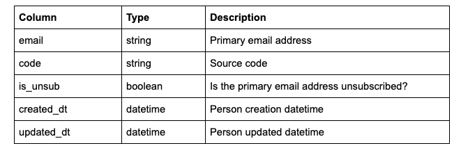
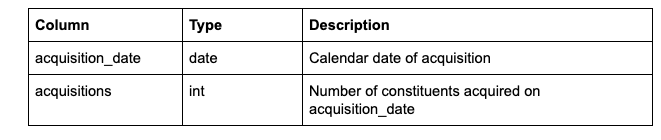

# Data Engineer Exercise

## Using public AWS S3 files, create two files with the following schemas:

### People File:

### Acquisition File:

## To replicate this process:

1. Fork and clone the repository.
2. Using the command 'pip install virtualenv' install virtualenv.
3. Change directories into the cloned folder.
4. Create a virtual environment with the command 'virtualenv newProject' (newProject is the project name and can be named anything you feel is relevant).
5. Activate the new virtual environment with the command 'source newProject/bin/activate', where newProject is replaced with the name of your newly created environment.
6. Install the necessary libraries with the command 'pip install -r requirements.txt'.
7. The command 'pip list' checks that all libraries have been installed.
8. Run the first part of the exercise with the 'python peopleFile.py' command.
9.  Run the second part of the exercise with the 'python acquisitionsFile.py' command.
10. 'deactivate' will deactivate the environment.
11.  'rm -rf newProject' will remove the environment.
